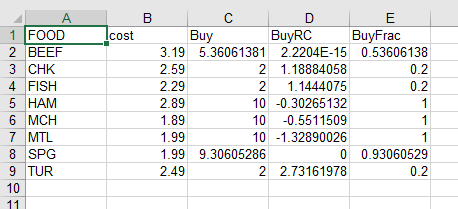

.. _amplxl:

AMPL Direct Spreadsheet Interface
=================================

We are pleased to announce our new, extended spreadsheet interface for AMPL, featuring support for

* spreadsheet software that recognizes .xlsx format files
* Windows, Linux, and macOS
* two-dimensional spreadsheet representations of multi-dimensional AMPL data
* data identified by full range, header range, or sheet name

The new interface works directly with .xlsx files for speed and reliability. It offers new, more convenient ways to identify and arrange data in sheets, while maintaining compatibility with existing AMPL `table` statements and interface conventions.

Installation
------------

Use one of the following links to download the table handler zipfile appropriate to your computer:

* Windows: `amplxl.win64.zip (64-bit) <https://ampl.com/dl/amplxl/amplxl.win64.zip>`_, `amplxl.win32.zip (32-bit) <https://ampl.com/dl/amplxl/amplxl.win32.zip>`_
* Linux: `amplxl.linux64.zip (64-bit) <https://ampl.com/dl/amplxl/amplxl.linux64.zip>`_, `amplxl.linux32.zip (32-bit) <https://ampl.com/dl/amplxl/amplxl.linux32.zip>`_
* macOS: `amplxl.macos.zip <https://ampl.com/dl/amplxl/amplxl.macos.zip>`_

Double-click the zipfile or use an unzip utility to extract the file `amplxl.dll`, and move this file into the folder (or Linux directory) that contains your AMPL program file: `ampl.exe` on Windows systems, or `ampl` on Linux and macOS systems.

Initial test
------------

To confirm that your installation is working, download `amplxl-test.zip <https://ampl.com/dl/amplxl/amplxl-test.zip>`_. Double-click the zipfile or use an unzip utility to extract the contents, which comprise three files: `diet.mod`, `diet.xlsx`, and `diet.run`.

* If you are using command-line AMPL, move the three files into the folder (or Linux directory) where you have put `amplxl.dll`. Then start AMPL from that folder.
* If you are using the AMPL IDE, move the three files into any convenient folder (or Linux directory). Start the AMPL IDE, and use the file pane at the left to make that folder current.

To run the test, execute the following AMPL commands in your command window or IDE console window:

.. code-block:: ampl

	load amplxl.dll;
	option solver minos;
	include diet.run;
	display Buy;

If you see the message `Cannot invoke minos: no such program` then replace minos in the `option solver` command by some other solver that is installed on your system. If you see the message `cannot extract workbook` then close diet.xlsx in your spreadsheet program and try again.

The AMPL script `diet.run` reads the AMPL model from `diet.mod`, reads the data from `diet.xlsx`, and solves the optimization problem. At completion, the command window or IDE console window should display results like the following:

.. code-block:: ampl

	ampl: load amplxl.dll;
	ampl: include diet.run;
	MINOS 5.51: optimal solution found.
	13 iterations, objective 118.0594032

	ampl: display Buy;
	Buy [*] :=
	BEEF   5.36061
	 CHK   2
	FISH   2
	 HAM  10
	 MCH  10
	 MTL  10
	 SPG   9.30605
	 TUR   2
	;
	ampl:

If you have specified a different solver, the “optimal solution” message will be different, but the reported result values should be the same to at least 5 decimal places.

The AMPL script also writes several columns of data and optimal results to a second spreadsheet file, `Buy.xlsx`. To complete the test, open that file in your spreadsheet application; or in the IDE, right-click the filename and select Open in External Editor from the menu that appears. You should then see a sheet named Results, containing this table of solution values:

|

Details of this image may differ, depending on your choice of spreadsheet software, but you should see the same data (again, at least to 5 decimal places). If you are unable to get these results, please report the differences that you observed to beta@ampl.com, including the text of any error messages; also if `Buy.xlsx` is different, add it as an attachment.

Conversion of existing applications
-----------------------------------

Only a few changes are needed to switch any of your applications to the new direct spreadsheet interface:

* Convert spreadsheet files: If you are using any spreadsheet files in the old .xls format, convert them to .xlsx format, using the Save As feature of your spreadsheet software or (for large numbers of files) a conversion utility. Then replace `.xls` by `.xlsx` in your table statements.
* Change the table handler name: In each table statement, replace `"ODBC"` or `"tableproxy" "odbc"` by `"amplxl"`.
* Load the new table handler: Add the AMPL command `load amplxl.dll`; before executing the first *read table* or *write table* command of your AMPL session.

Please report any problems to beta@ampl.com, with listings, screenshots, and attached files as appropriate.

Learning more
-------------

The AMPL book’s chapter 10 `Database Access <https://ampl.com/BOOK/CHAPTERS/13-tables.pdf>`_ introduces the use of *table* statements for data transfer. Although the presentation is not specific to spreadsheets, all of the examples can be adapted to work with the new amplxl spreadsheet handler. Thus we recommend reading at least sections 10.1 though 10.4 if you have not used any AMPL spreadsheet interface previously.

We have also prepared a collection of examples that highlight new features of the amplxl interface. To get the example files, download `amplxl-examples.zip <https://ampl.com/dl/amplxl/amplxl-examples.zip>`_. Double-click the zipfile or use an unzip utility to extract the contents, which comprise four AMPL scripts and two spreadsheet files.

* If you are using command-line AMPL, move these files into the folder (or Linux directory) where you have put `amplxl.dll`. Then start AMPL from that folder.
* If you are using the *AMPL IDE*, move these files into any convenient folder (or Linux directory). Start the *AMPL IDE*, and use the file pane at the left to make that folder current.

Use commands like `include amplxl-ex1.run;` to execute the scripts. The following comments explain how they work. Currently amplxl backs up spreadsheet files by default, creating *.amplback* files that appear in the same directory. To suppress the backups, add the string *"backup=false"* to the options in the *table* declaration.

`amplxl-ex1.run <https://ampl.com/dl/amplxl/examples/amplxl-ex1.run>`_ writes three data tables to the spreadsheet file `ex1.xlsx <https://ampl.com/dl/amplxl/examples/ex1.xlsx>`_, then reads the data back into AMPL and displays it. The file has been set up to show three ways of specifying where the data should be written:

* The entire table *Aset* is identified by a named range.
* Only the header of table *Bset* is identified by a named range. This alternative allows the number of rows in the table to be determined dynamically.
* Table *pvals* is identified by a sheet name. This alternative allows for writing one table per sheet, without the need to define range names.

In the second part of the example, the same alternatives are employed to determine the locations from which the data should be read.

`amplxl-ex2.run <https://ampl.com/dl/amplxl/examples/amplxl-ex2.run>`_ introduces two-dimensional spreadsheet tables for representing AMPL data indexed over two sets. The same data is written to two different spreadsheet files and then read from those files, but using different table statements:

* table ex2_1D specifies a traditional “one-dimensional” relational table, for which each row of spreadsheet data has two keys and a value:

  .. image:: ex2_1D.png
  |

* table ex2_2D has the additional keyword string "2D" in its declaration, to specify that the data for an AMPL parameter will be represented in a two-dimensional table, with keys from one set labeling the rows, and keys from the other set labeling the columns:

  .. image:: ex2_2D.png
  |

A table statement that specifies "2D" must list only one parameter (or other indexed collection of values) to be read or written:

* When writing to a 2D table, by default the first set named in the table statement labels the rows, and the second labels the columns. (See `amplxl-ex4.run` below for alternatives.)
* When reading from a 2D table, amplxl looks for a column headed by the name of one of the sets — A in this example — and takes that to be the column of row labels. All of the other columns are assumed to be headed by members from the other set — B in this example — even though the name of that set does not appear. Also the name of the parameter — p in this example — does not need to appear, since the table statement specifies exactly one parameter to be read.

Since file names are not specified in the table statements for this example, the amplxl table handler takes the names of the files to be `ex1D.xlsx` and `ex2D.xlsx`. And since those files do not yet exist when the *write table* statements are executed, amplxl creates them, and saves the data on new sheets named ex1D and ex2D.

`amplxl-ex3.run <https://ampl.com/dl/amplxl/examples/amplxl-ex3.run>`_ shows the concept of two-dimensional tables extended to AMPL data indexed over three sets. As in the previous example, the same data is written twice, but using different table statements:

* table ex3_1D specifies a traditional relational table, for which each row of spreadsheet data has three keys and a value.
* table ex3_2D has the additional keyword string "2D" in its declaration, to specify that the data for an AMPL parameter will be represented in a two-dimensional table, with pairs of keys from the first two sets labeling the rows, and keys from the third set labeling the columns.

Two spreadsheet files are written as in the previous example. Parameters indexed over more than three sets are handled in an analogous manner, with always one label on the columns and other labels on the rows.

`amplxl-ex4.run <https://ampl.com/dl/amplxl/examples/amplxl-ex4.run>`_ shows how the positioning of row and column labels of a two-dimensional spreadsheet table can be specified, by setting up headers in the spreadsheet `ex4.xlsx <https://ampl.com/dl/amplxl/examples/ex4.xlsx>`_ before it is written. (Currently it is not possible for the table statement to specify this positioning.) Three tables ex4_1, ex4_2, and ex4_3 have exactly the same declaration in the AMPL script, but are written differently to match the headers set up in the spreadsheet file. Similar to the first example, the entire table ex4_1 is identified by a named range; only the header of table ex4_2 is identified by a named range; and table ex4_3 is identified by a sheet name.
