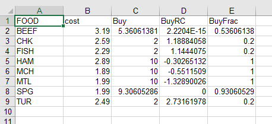

.. _amplcsv:

AMPL CSV File Interface
=======================

This page describes a new AMPL interface for files in `CSV format <https://en.wikipedia.org/wiki/Comma-separated_values>`_. It uses the same table statements as AMPL’s other data interfaces, but works directly with .csv files for speed and reliability.

If you are using .csv files with spreadsheet software, you may also be interested in AMPL’s :doc:`amplxl` that reads and writes .xlsx format files.

Installation
------------
Use one of the following links to download the csv table handler zipfile appropriate to your computer:

* Windows: `amplcsv.win64.zip (64-bit) <https://portal.ampl.com/~nfbvs/amplcsv/amplcsv.win64.zip>`_, `amplcsv.win32.zip (32-bit) <https://portal.ampl.com/~nfbvs/amplcsv/amplcsv.win32.zip>`_
* Linux: `amplcsv.linux64.zip (64-bit) <https://portal.ampl.com/~nfbvs/amplcsv/amplcsv.linux64.zip>`_, `amplcsv.linux32.zip (32-bit) <https://portal.ampl.com/~nfbvs/amplcsv/amplcsv.linux32.zip>`_
* macOS: `amplcsv.macos.zip <https://portal.ampl.com/~nfbvs/amplcsv/amplcsv.macos.zip>`_

Double-click the zipfile or use an unzip utility to extract the file `amplcsv.dll`. Then move `amplcsv.dll` into the same Windows/macOS folder or Linux directory as your AMPL program file. (The AMPL program file is `ampl.exe` on Windows systems, and `ampl` on Linux and macOS systems.)

Initial test
------------
To confirm that your installation is working, download `amplcsv-test.zip <https://portal.ampl.com/~nfbvs/amplcsv/amplcsv-test.zip>`_. Double-click the zipfile or use an unzip utility to extract the contents, which comprise 5 files: `diet.mod`, `foods.csv`, `nutrients.csv`, `amounts.csv`, and `diet.run`.

* If you are using command-line AMPL, move the 5 files into the folder (or Linux directory) where you have put `amplcsv.dll`. Then start AMPL from that folder.
* If you are using the AMPL IDE, move the 5 files into any convenient folder (or Linux directory). Start the AMPL IDE, and use the IDE’s file pane (at the left) to make that folder current.

To run the test, execute the following AMPL commands in your command window or IDE console window:

.. code-block:: ampl

    load amplcsv.dll;
    option solver minos;
    include diet.run;
    display Buy;

If you see the message `Cannot invoke minos: no such program` then replace minos in the `option solver` command by a solver that is installed on your system.

The AMPL script `diet.run` reads the AMPL model from `diet.mod`, reads the data from `foods.csv`, `nutrients.csv`, and `amounts.csv`, and solves the optimization problem. At completion, the command window or IDE console window should display results like the following:

.. code-block:: dummy

    ampl: load amplcsv.dll;
    ampl: include diet.run;
    MINOS 5.51: optimal solution found.
    13 iterations, objective 118.0594032

    ampl: display Buy;
    Buy [*] :=
    BEEF   5.36061
     CHK   2
    FISH   2
     HAM  10
     MCH  10
     MTL  10
     SPG   9.30605
     TUR   2
    ;
    ampl:

If you have specified a different solver, the “optimal solution” message will be different, but the reported result values should be the same to many decimal places.

The AMPL script also writes several columns of data and optimal results to a new csv format file, `Buy.csv`. To complete the test, open `Buy.csv` as a text file, and confirm that you see the following lines:

.. code-block:: dummy

    FOOD,cost,Buy,BuyRC,BuyFrac
    BEEF,3.19,5.360613810741664,2.220446049250313e-15,0.5360613810741663
    CHK,2.59,2,1.188840579710143,0.2
    FISH,2.29,2,1.144407502131287,0.2
    HAM,2.89,10,-0.30265132139812123,1
    MCH,1.89,10,-0.5511508951406645,1
    MTL,1.99,10,-1.3289002557544731,1
    SPG,1.99,9.306052855924994,0,0.9306052855924994
    TUR,2.49,2,2.7316197783461185,0.2

If your system is configured to open .csv files in a spreadsheet program, however, then you may instead see a display like this:

|
Details of this image may differ, depending on your choice of spreadsheet software; in particular, the number of decimal places shown will depend on the width of the columns. If you are unable to get these results, please report the differences that you observed to beta@ampl.com, including the text of any error messages; also if `Buy.csv` is different, include it as an attachment.

Learning more
-------------
The AMPL book’s chapter 10 `Database Access <https://ampl.com/BOOK/CHAPTERS/13-tables.pdf>`_ introduces the use of table statements for data transfer. Although the presentation is not specific to CSV files, the examples in that chapter can be adapted to work with the new amplcsv table handler. Thus we recommend reading at least sections 10.1 though 10.4 if you have not used any AMPL data table interface previously.

The amplcsv table handler recognizes the following option strings when they are included in AMPL table statements. (After `load amplcsv.dll;` has been executed, you can also display this listing by use of the AMPL command `print _handler_desc["amplcsv"];`.)

.. code-block:: dummy

    alias:
        Instead of writing the data to a specific .csv file it is
        possible to define an alias. In the following example the table
        handler will search for the file tablealias.csv to write the data.
        If the file does not exist it will be created.

        Example:
            table tablename OUT "amplcsv" "tablealias": [A], B;

    external-table-spec:
        Specifies the path to the .csv file to be read or written with
        the read table and write table commands. If no file is
        specified, amplcsv will search for a file with the table name
        and the .csv file extension in the current directory. If the
        table is to be written and the file does not exist it will be
        created.

        Example:
            table tablename OUT "amplcsv" "filename.csv": [keycol], valcol;

    header=option:
        Whether or not to read/write the header from the .csv file
        (defaults to true). If the option "header=false"  is specified,
        amplcsv will assume that the external table does not have a
        header and that the order of the columns in AMPL and in the .csv
        file is the same.

        Example:
            table tablename OUT "amplcsv" "header=false": [keycol], valcol;

    overwrite:
        (OUT only) If the option is used the external table will be
        completely overwritten. Note that, by default, in OUT mode
        amplcsv will maintain the initial header.

        Example:
            table tablename OUT "amplcsv" "overwrite": [keycol], valcol;

    quote=option:
        Whether or not to quote strings when writing data to a file or
        unquote strings when reading data from a file. Available
        options: "none" (default), "single" for single quotes and
        "double" for double quotes.

        Example:
            table tablename IN "amplcsv" "quote=double": keycol <- [keycol], valcol;

    sep=option:
        Specifies the separator character in the .csv file. Available
        options:
            comma (default) - "," character separator,
            semicolon - ";" character separator,
            colon - ":" character separator,
            tab - tab character separator,
            space - single space separator.

        Example:
            table tablename IN "amplcsv" "sep=tab": keycol <- [keycol], valcol;

    verbose:
        Display warnings during the execution of the read table and
        write table commands.

        Example:
            table tablename OUT "amplcsv" "verbose": [keycol], valcol;

    verbose=option:
        Display information according to the specified option. Available
        options:
            0 (default) - display information only on error,
            1 - display warnings,
            2 - display general information
            3 - display debug information.

        Example:
            table tablename OUT "amplcsv" "verbose=2": [keycol], valcol;
